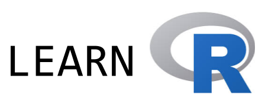

In this post, I come back to my first experience teaching an advanced R course over the past month. 

<a href="https://privefl.github.io/advr38book/" target="_blank">
```{r, out.width="50%", fig.align='center', echo=FALSE}

```
</a>

## Content

This course was programmed for 10 sessions (3 hours each) and I initially wanted to talk about the following subjects:

1. R programming and good practices (2 sessions)

2. Data analysis with the tidyverse (3 sessions)

3. R code performance (2 sessions)

4. R packages (2 sessions)

5. Bonus: Shiny (1 session)

I basically sticked to this.

I should also mention the public: PhD students.

## Materials

At first, I wanted to do an interactive course using package [{learnr}](https://rstudio.github.io/learnr/) but it would have required way too much work (my thesis supervisor would not have been happy!).
So, finally I decided to use package [{bookdown}](https://bookdown.org/yihui/bookdown/). Using {bookdown} was really easy, and knowing how to use it now will spare me some time when I will write my thesis manuscript.

Materials are available [there](https://privefl.github.io/advr38book/index.html).

I also decided to create an associated package for mainly two reasons:

- to make students install package dependencies that we needed in this course,

- to make solutions available for [the chapter on code performance](https://privefl.github.io/advr38book/performance.html).

This idea of having a bookdown for materials with an associated package is not new (e.g. see [the *Efficient R Programming* book](https://bookdown.org/csgillespie/efficientR/) and [its associated package](https://github.com/csgillespie/efficient)).

I also introduced my students to [Slack](https://slack.com) so that we could communicate and share code.

## All chapters

1. I started the course with [good practices](https://privefl.github.io/advr38book/good-practices.html) such as coding style, using RStudio and Git, and getting help.

2. I continued the course with some [base R programming](https://privefl.github.io/advr38book/r-programming.html). This is not the funniest part of the course, but knowing this seemed to me as inevitable to be proficient in R.

3. Then, [we learned about the tidyverse](https://privefl.github.io/advr38book/tidyverse.html) using [the R for Data Science book](http://r4ds.had.co.nz/). While teaching this course, I have discovered that many people still don't use {ggplot2} and {dplyr}. So, I had to introduce these two packages from scratch and it took me longer than I had anticipated. In 3 sessions (9h), I had the time to cover R Markdown, {ggplot2} and {dplyr} only.
    
4. After the tidyverse, I covered [performance of R code](https://privefl.github.io/advr38book/performance.html). I really like to solve performance problems on Stack Overflow and (I think) I'm really good at it. So, this may have been the chapter I could bring the most to the table. Moreover, one student came with one of the problem she had, and I used her problem as an exercise. At the end, she was able to make her code more than 1000 times faster. For the other exercises, I mainly used problems I had answered on Stack Overflow.

5. For the last chapter, we covered [how to make an R package](https://privefl.github.io/advr38book/packages.html). I showed them that it was really easy and fast, mainly thanks to packages {usethis} and {roxygen2}. We had time to cover the full documentation, testing, automatic checking of packages and even how to make a website of a package.

6. Finally, the last session was a "bonus" session we could use either to spend more time on any topic or just to learn something fun like {Shiny}. Indeed, we could have spent at least two more sessions on the tidyverse and one on practicing about performance of R code. 
Using a [Slack poll](https://simplepoll.rocks/), we agreed to [learn Shiny](https://privefl.github.io/advr38book/shiny.html). For this, I used [this nice and free DataCamp course](https://www.datacamp.com/courses/building-web-applications-in-r-with-shiny). 

## Retrospective thoughts

1. At least half of the materials I used is borrowed from others. At first, I felt bad about this because I felt lazy. But it has already taken me a lot of time to prepare these materials, just reinventing the wheel with some new materials that were already out there would have not been good for me or my students.

2. I think using {bookdown}, Git and Slack was a good idea.

2. I feel like I've covered lots of useful things. However, I would have wanted my course to be useful for more people (I had only ~10 students). Hopefully these materials will be useful for other people outside Grenoble, France.

    So don't hesitate to comment this post or ask some questions!
