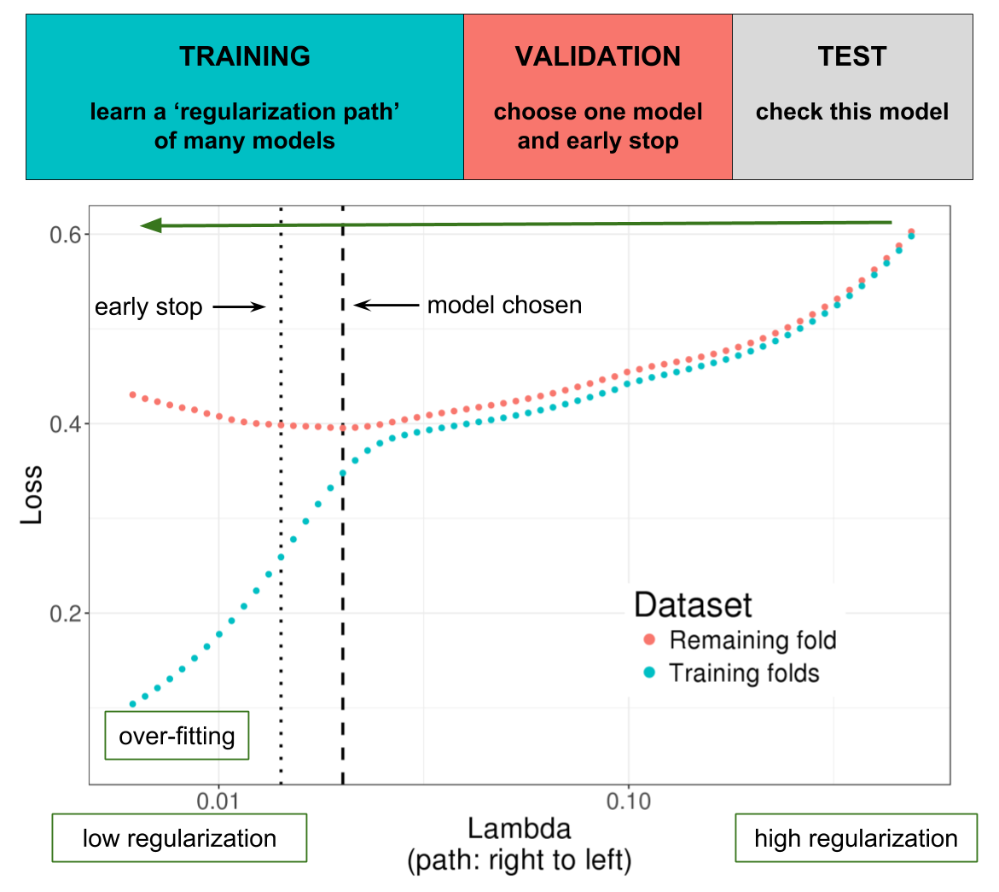

```{r setup, include=FALSE}
knitr::opts_chunk$set(echo = TRUE, fig.align = "center")
```

In this post, I'm evaluating some ways of choosing hyper-parameters ($\alpha$ and $\lambda$) in penalized linear regression. The same principles can be applied to other types of penalized regresions (e.g. logistic).

## Model

In penalized linear regression, we find regression coefficients $\hat{\beta}_0$ and $\hat{\beta}$ that minimize the following regularized loss function \[L(\lambda, \alpha) = \underbrace{ \frac{1}{2n} \sum_{i=1}^n \left( y_i - \hat{y}_i \right)^2 }_\text{Loss function}   +   \underbrace{ \lambda \left((1-\alpha)\frac{1}{2}\|\hat{\beta}\|_2^2 + \alpha \|\hat{\beta}\|_1\right) }_\text{Penalization} ~,\] where $\hat{y}_i=\hat{\beta}_0 + x_i^T\hat{\beta}$, $0 \le \alpha \le 1$ and $\lambda > 0$.

This regularization is called elastic-net and has two particular cases, namely LASSO ($\alpha = 1$) and ridge ($\alpha = 0$). So, in elastic-net regularization, hyper-parameter $\alpha$ accounts for the relative importance of the L1 (LASSO) and L2 (ridge) regularizations. There is another hyper-parameter, $\lambda$, that accounts for the amount of regularization used in the model. 

I won't discuss the benefits of using regularization here.

## Data

In this blog post, I'm using the [Breast cancer gene expression data from The Cancer Genome Atlas](http://myweb.uiowa.edu/pbreheny/data/bcTCGA.html).

```{r}
dir.create(dir <- "/tmp/data", showWarnings = FALSE)
file <- file.path(dir, "bcTCGA.rds")
if (!file.exists(file)) {
  download.file("https://s3.amazonaws.com/pbreheny-data-sets/bcTCGA.rds",
                destfile = file)
}
bcTCGA <- readRDS(file)
```

```{r}
X <- bcTCGA$X
dim(X)
X[1:5, 1:5]
y <- bcTCGA$y
hist(y)
```

## Methods compared

I'm comparing 6 different estimations of $y$ with the following code. I'm explaining what are these estimations after the code.

```{r, eval=FALSE}
timing <- function(expr) system.time(expr)[3]

RMSE <- function(pred, y.test) {
  stopifnot(length(pred) == length(y.test))
  mean((pred - y.test)^2)
}

set.seed(1)
# !! 5h of computations on my computer !! 
res_all <- replicate(200, simplify = FALSE, {

  ind.train <- sample(nrow(X), 400)
  ind.test  <- setdiff(1:nrow(X), ind.train)

  library(glmnet)
  t_all <- timing(mod_all <- glmnet(X[ind.train, ], y[ind.train]))
  preds_all <- predict(mod_all, X[ind.test, ])
  rmse_all <- apply(preds_all, 2, RMSE, y[ind.test])

  t_cv <- timing(mod_cv <- cv.glmnet(X[ind.train, ], y[ind.train]))
  preds_1se <- predict(mod_cv, X[ind.test, ], s = "lambda.1se")
  rmse_1se <- RMSE(preds_1se, y[ind.test])
  preds_min <- predict(mod_cv, X[ind.test, ], s = "lambda.min")
  rmse_min <- RMSE(preds_min, y[ind.test])

  library(bigstatsr)
  t_CMSA <- timing({
    X2 <- as_FBM(X)
    mod_CMSA <- big_spLinReg(X2, y[ind.train], ind.train)
  })
  preds_CMSA <- predict(mod_CMSA, X2, ind.test)
  rmse_CMSA <- RMSE(preds_CMSA, y[ind.test])

  library(glmnetUtils)
  ALPHA <- c(1, 0.5, 0.1)
  t_cva <- timing(mod_cva <- cva.glmnet(X[ind.train, ], y[ind.train], alpha = ALPHA))
  alpha <- ALPHA[which.min(sapply(mod_cva$modlist, function(mod) min(mod$cvm)))]
  rmse_cva <- RMSE(predict(mod_cva, X[ind.test, ], alpha = alpha), y[ind.test])

  t_CMSA2 <- timing({
    X2 <- as_FBM(X)
    mod_CMSA2 <- big_spLinReg(X2, y[ind.train], ind.train, alphas = ALPHA)
  })
  preds_CMSA2 <- predict(mod_CMSA2, X2, ind.test)
  rmse_CMSA2 <- RMSE(preds_CMSA2, y[ind.test])

  tibble::tribble(
    ~method,        ~timing,  ~rmse,
    "glmnet_best",  t_all,    min(rmse_all),
    "glmnet_min",   t_cv,     rmse_1se,
    "glmnet_1se",   t_cv,     rmse_min,
    "CMSA",         t_CMSA,   rmse_CMSA,
    "glmnet_cva",   t_cva,    rmse_cva,
    "CMSA2",        t_CMSA2,  rmse_CMSA2
  )

})

res <- do.call(rbind, res_all)
res$run_number <- rep(seq_along(res_all), each = 6)
```

The methods compared are:

- **glmnet_best**: the best prediction (on the test set) among all 100 different $\lambda$ values (using $\alpha = 1$). This is an upper bound of predictive performance using package {glmnet} with L1 regularization.
- **glmnet_min**: the prediction corresponding to the $\lambda$ that minimizes the error of cross-validation.
- **glmnet_1se**: similar to **glmnet_min**, but a little more regularized (the maximum regularization whose error of cross-validation is only one standard error away from the minimum).
- **CMSA**: using cross-model selection and averaging (CMSA, explained in the next session) to "choose" $\lambda$.
- **glmnet_cva**: using cross-validation of glmnet on both $\lambda$ AND $\alpha$. Using `"lambda.1se"` (the default) and $\alpha$ that minimizes the error of cross-validation.
- **CMSA2**: using cross-model selection and averaging (CMSA, explained in the next session) to "choose" $\lambda$ AND $\alpha$.

## Cross-Model Selection and Averaging (CMSA)

**Source:** https://doi.org/10.1101/403337

```{r, echo=FALSE, out.width="80%"}

```

Illustration of one turn of the Cross-Model Selection and Averaging (CMSA) procedure. First, this procedure separates the training set in $K$ folds (e.g. 10 folds). Secondly, in turn, each fold is considered as an inner validation set (red) and the other ($K - 1$) folds form an inner training set (blue). A "regularization path" of models is trained on the inner training set and the corresponding predictions (scores) for the inner validation set are computed. The model that minimizes the loss on the inner validation set is selected. Finally, the $K$ resulting models are averaged. We also use this procedure to derive an early stopping criterion so that the algorithm does not need to evaluate the whole regularization paths, making this procedure much faster.

## Results

```{r, echo=FALSE}
res <- readRDS("../results/glmnet.rds")
```

```{r}
library(dplyr, warn.conflicts = FALSE)

res %>%
  group_by(method) %>%
  summarise_at(c("rmse", "timing"), mean) %>%
  arrange(rmse)
```

So, basically both CMSA from {bigstatsr} and choosing "lambda.1se" from standard cross-validation using {glmnet} provide near-optimal results (0.215 and 0.212 vs 0.208). Yet, CMSA is much faster than cross-validation (due to early stopping).

We also see that using "lambda.1se" performs better than using "lambda.min" for this example, which is confirming what I have seen and read before.

Finally, we see that testing two other values of $\alpha$ (0.5 and 0.1 in addition to 1) does not improve predictive performance for this example (0.213 vs 0.212 for CMSA and 0.240 vs 0.215 for cross-validation using {glmnet}).

## Conclusion

Usually, cross-validation is used to choose hyper-parameter values and then the model is trained again with these particular hyper-parameter values. Yet, performing cross-validation and retraining the model is computationally demanding; CMSA offers a less burdensome alternative, especially because of the early stopping criterion.

Moreover, CMSA doesn't fit only one model, but instead average over $K$ models, which makes it less noisy (see the last previous results).

Finally, I think CMSA offers a very convenient approach because it is both stable and fast. Moreover, as it is implemented in my package {bigstatsr} that uses filebacked matrices (inspired by packages [{bigmemory}](https://github.com/kaneplusplus/bigmemory) and [{biglasso}](https://github.com/YaohuiZeng/biglasso)), this algorithm can be run on 100 GB of data. For example, this is what I used for a previous post about [predicting height based on DNA mutations](https://privefl.github.io/blog/predicting-height-based-on-dna-mutations/), using a matrix of size 400K x 560K!

Yet, {bigstatsr} only provides linear and logistic regressions. And it doesn't implement all the many options supported by {glmnet}. I think it would be of great interest if someone could implement the CMSA procedure for all {glmnet} models and options. Unfortunately, I don't have time to do it as I need to finish my thesis before next summer.
