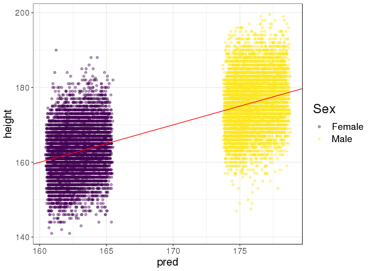
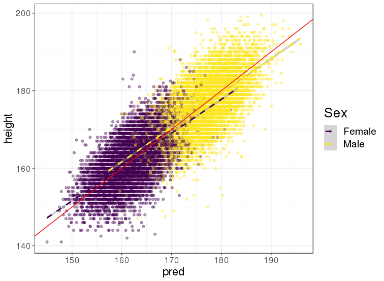
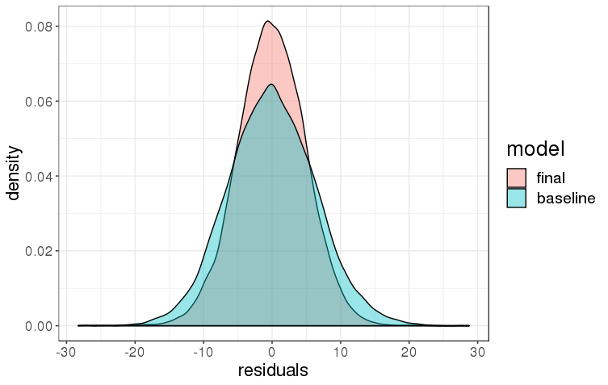

<section class="main-content">

In this post, I show some results of predicting height based on DNA mutations. This analysis aims at reproducing the analysis <a href="https://doi.org/10.1534/genetics.118.301267">of this paper</a> using <a href="https://doi.org/10.1093/bioinformatics/bty185">my own analysis tools in</a>.

I use a new dataset composed of 500,000 adults from UK, and genotyped over hundreds of thousands of DNA positions. This dataset is called <a href="https://www.ukbiobank.ac.uk/">the UK biobank</a>, and also provide some baseline characteristics such as sex and birth date, which are useful for predicting height.

<h2>Model</h2>

<h3>Data</h3>

After some quality control and filtering, I end up with a dataset composed of 394,436 individuals genotyped over 564,148 DNA positions. This results in a matrix that counts the number of mutations (0, 1, or 2) for a given individual (observation) and a given DNA position (variable). Even if I can store each element of this matrix using one byte only, this results in ~200 GB of data.

I use 20,000 individuals as test set, and the rest as training set.

<h3>Baseline model</h3>

Before using DNA mutations, let us make a model with only two variables:

<ul>
<li>sex</li>
<li>birth date (year and month)</li>
</ul>
<pre><code>Coefficients:
               Estimate Std. Error  t value Pr(&gt;|t|)    
(Intercept)  154.503399   0.091744 1684.075   &lt;2e-16 ***
date           0.157243   0.001749   89.920   &lt;2e-16 ***
sexMale       13.436380   0.132919  101.087   &lt;2e-16 ***
date:sexMale  -0.003000   0.002544   -1.179    0.238    </code></pre>

So basically, <strong>men are ~13.4 cm taller than women in average</strong>. There is also an effect due to societal changes (“Flynn Effects”) that results in <strong>people being 1 cm taller in average every ~6 years</strong> (I don’t mean people getting older, but people being born more recently).

Base prediction of height based on sex and birth date.

<h3>Model when adding tens of thousands of DNA mutations</h3>

Because of the size of the data and because effects of mutations are usually very small and additive, I use a linear model with lasso penalty to take into account many but not all DNA mutations (as in the paper I linked above).

Final prediction of height based on DNA mutations, sex and birth date.

<strong>Predicted height correlates with actual height at 65.5% for women and 65% for men</strong>; 61.8% and 61.4% if using DNA mutations only (without birth date). Note that it is estimated that prediction based on DNA mutations only could achieve a correlation of 70% at most.

Residuals from baseline and final predictions of height.

So, with this model combining sex, birth date and DNA mutations, <strong>predictions are precise within 8 cm for 90% of people and within 4 cm for 60% of people</strong>.

<h2>Conclusion</h2>

The UK biobank contains lots of information that could be used to predict e.g. people height. There are also some information about e.g. environmental factors that could be useful to predict height. <strong>Tell me if you have any idea</strong> and I’ll try to add new variables to the current model.

</section>
